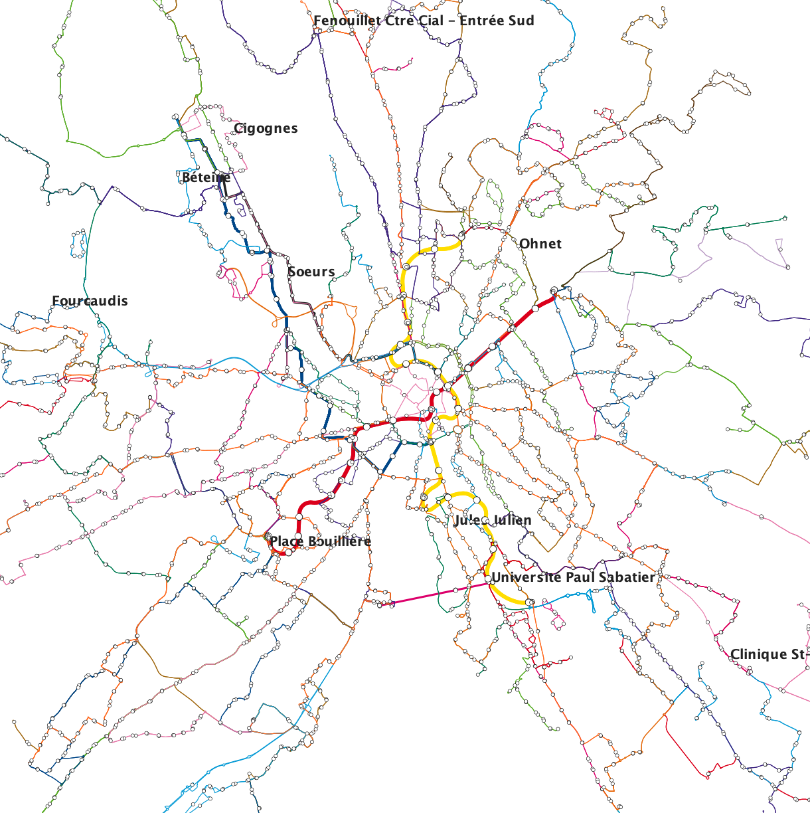

# LLM Agents & GAMA platform
Modeling realistic human behavior using generative agents in a multimodal transport system: Software architecture and Application to Toulouse.

<!--  -->

## Source references

- GTFS references: https://gtfs.org/resources/gtfs/
- GTFS data: https://data.toulouse-metropole.fr/explore/dataset/tisseo-gtfs/information/
- Other map & population data: https://github.com/eqasim-org/ile-de-france/blob/develop/docs/cases/toulouse.md
- OpenTripPlanner: https://www.opentripplanner.org/

## Architecture


## User guide

### 1. Population synthetic data

Follow this [guide](https://github.com/eqasim-org/ile-de-france/blob/develop/docs/cases/toulouse.md) to generate the population synthetic data.

The synthetic data includes the activities list for each person; this data is combined with the `trait` data as in the sample file data/population_samples/Lila.agent.json. For example, the final population is data/population_samples/population_5_5.json.

### 2. Setup OpenTripPlanner

- Download OTP binary from this [guide](https://docs.opentripplanner.org/en/v2.7.0/Getting-OTP/), then put the jar file into the `otp-toulouse/bin/` folder.

- Download the GTFS data from this [link](https://data.toulouse-metropole.fr/explore/dataset/tisseo-gtfs/information/), and extract the GTFS file into the `otp-toulouse/toulouse/gtfs` folder.

- Download the `Toulouse.osm.pbf` file from this [link](https://download.bbbike.org/osm/bbbike/Toulouse/) (find it from the Protocolbuffer (PBF) link on the left side), then put it in the `otp-toulouse/toulouse` folder.

- Run the following commands:

```shell
cd otp-toulouse/

# build the graph.obj file
java -Xmx4G -jar ./bin/otp-shaded-2.7.0.jar --build ./toulouse --save

# run the server
java -Xmx4G -jar ./bin/otp-shaded-2.7.0.jar --load ./toulouse
```

### 3. Prepare the GTFS data for the LLM agent and GAMA model

- Download the GTFS data and extract it into the `data/gtfs` folder.

- Run the following commands. This script builds the GTFS data file - `trip_info.json` - that the models in the GAMA platform can read, and moves this file into the model folder (GAMA/CityTransport/includes/).

```shell
cd scripts/
bash update_gtfs_data.sh
```

### 4. Prepare the config file and workdir

- Create a new config file in the llm-agents/config folder (see the examples in this folder, and find more details in the llm-agents/settings file).

- Copy the sample `population.json` file into the `workdir` folder (which is a setting in the `config.toml` file). Make sure the file name is in the format `population_<number of people>_<number of agents>.json`.

- Depending on which LLM provider you use, populate the api key in the `llm-agents/.envrc` file. The template for this file can be found in `llm-agents/.envrc.example`. In this source code, we support [OpenAI](https://platform.openai.com/), [Groq](https://groq.com/), and self-hosted [vLLM](https://docs.vllm.ai/). If you use vLLM, please populate your `HF_TOKEN` to allow vLLM to download the model from the Hugging Face repository. The `.envrc` file should be loaded as environment variables; you can use direnv for this.

- If you want to experiment with other models, please add a new section in the MODELS list in the `settings.py` file

    ```json
    {
        "code": "openai/gpt-oss-120b",
        "model": "openai/gpt-oss-120b",
        "llm_provider": "vllm",
        "api_key": os.getenv("GROQ_API_KEY"),
        "api_url": "https://api.groq.com/openai/v1",
    },
    ```


### 5. Run the simulation

- Start the GAMA model first. The entry model is `GAMA/CityTransport/City.gaml`.

- Start the LLM-Agent next:

```shell
cd llm-agents/
poetry run python server.py --config ./config/config_gpt-oss-120b_19.yaml
```

- Go back to GAMA and hit the play button to start the simulation.

## Reference

```
@misc{vu2025modelingrealistichumanbehavior,
      title={Modeling realistic human behavior using generative agents in a multimodal transport system: Software architecture and Application to Toulouse}, 
      author={Trung-Dung Vu and Benoit Gaudou and Kamaldeep Singh Oberoi},
      year={2025},
      eprint={2510.19497},
      archivePrefix={arXiv},
      primaryClass={cs.MA},
      url={https://arxiv.org/abs/2510.19497}, 
}
```
